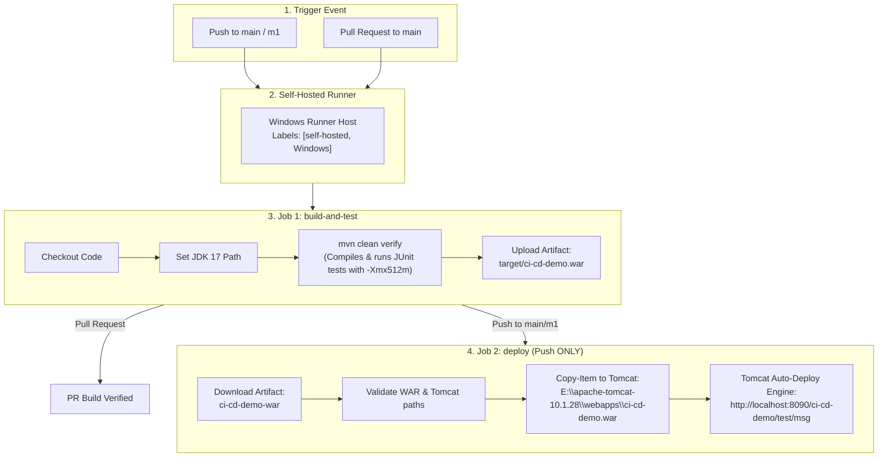

# Simplified Workflow Technical Analysis Report

**Repository**: `anchitchourasia/complete-ci-cd-v1`  
**Target File**: `.github/workflows/cicd.yml`  
**Document Purpose**: In-depth technical breakdown of the simplified 2-job CI/CD pipeline, runner execution parameters, Maven configuration, and Tomcat deployment mechanics.

---

## 1. Pipeline Architecture Flowchart



---

## 2. Event Triggers & Execution Logic

* **File Reference**: [.github/workflows/cicd.yml](.github/workflows/cicd.yml)

| Trigger Event | Target Branch | `build-and-test` Job | `deploy` Job |
| :--- | :--- | :---: | :---: |
| **Push** | `main` or `m1` | Executed | **Executed** |
| **Pull Request** | `main` | Executed | **Skipped** |
| **Pull Request** | `m1` | Not Triggered | **Not Triggered** |

### Event Rules Explanation:
- `on.push.branches: [main, m1]`: Triggers the pipeline when commits are pushed directly to `main` or `m1`.
- `on.pull_request.branches: [main]`: Triggers the pipeline when a Pull Request is opened or updated targeting `main`.
- `deploy.if: github.event_name == 'push'`: Ensures deployment executes **only** on push events, skipping deployment during Pull Request builds.

---

## 3. Environment Variables Technical Breakdown

```yaml
env:
  MAVEN_BIN: 'C:\maven\apache-maven-3.9.12\59fe215c0ad6947fea90184bf7add084544567b927287592651fda3782e0e798\bin\mvn.cmd'
  SETTINGS_XML: 'C:\maven\settings.xml'
  JAVA_HOME: 'C:\Program Files\Java\jdk-17'
  HTTP_PROXY: 'http://192.168.9.112:808'
  HTTPS_PROXY: 'http://192.168.9.112:808'
  NO_PROXY: '192.168.8.25,localhost,127.0.0.1'
  MAVEN_OPTS: '-Xmx512m -Xms256m'
```

### Detailed Purpose:
1. **`MAVEN_BIN`**: Absolute path to the Maven executable batch script on the Windows runner.
2. **`SETTINGS_XML`**: Absolute path to custom Maven settings file configured with corporate repository mirrors.
3. **`JAVA_HOME`**: Points to the Java 17 Development Kit root folder. In step scripts, `$env:PATH = "$env:JAVA_HOME\bin;$env:PATH"` prepends `java.exe` and `javac.exe` to the system execution path.
4. **`HTTP_PROXY` / `HTTPS_PROXY`**: Directs outbound HTTP/HTTPS requests through corporate proxy `192.168.9.112:808`.
5. **`NO_PROXY`**: Bypasses the proxy for local addresses (`localhost`, `127.0.0.1`, `192.168.8.25`).
6. **`MAVEN_OPTS`**: Limits JVM heap memory (`-Xmx512m -Xms256m`). Capping memory at 512 MB resolves Windows virtual memory pagefile allocation errors (`DOS errno 1455`) during Maven test execution.

---

## 4. Step-by-Step Code Analysis

### Job 1: `build-and-test`
1. **Checkout source code**: `actions/checkout@v4` fetches repository files into the runner workspace directory (`$env:GITHUB_WORKSPACE`).
2. **Build WAR and run tests**:
   ```powershell
   $env:PATH = "$env:JAVA_HOME\bin;$env:PATH"
   & $env:MAVEN_BIN -s $env:SETTINGS_XML clean verify --no-transfer-progress
   if ($LASTEXITCODE -ne 0) { exit $LASTEXITCODE }
   ```
   - Sets Java 17 path and runs `mvn clean verify`.
   - Compiles source code, runs JUnit unit tests via Surefire plugin, and packages `target/ci-cd-demo.war`.
   - Checks `$LASTEXITCODE` to ensure the job fails immediately if Maven compilation or tests fail.
3. **Upload WAR artifact**: `actions/upload-artifact@v4` uploads `target/ci-cd-demo.war` as workflow artifact `ci-cd-demo-war`.

### Job 2: `deploy`
1. **Download WAR artifact**: `actions/download-artifact@v4` downloads `ci-cd-demo-war` into `./deploy-artifact/`.
2. **Copy WAR to Tomcat webapps**:
   ```powershell
   $tomcatWebapps = 'E:\apache-tomcat-10.1.28\webapps'
   $warSource = Join-Path $env:GITHUB_WORKSPACE 'deploy-artifact\ci-cd-demo.war'
   
   if (-not (Test-Path $warSource)) { throw "WAR file not found!" }
   if (-not (Test-Path $tomcatWebapps)) { throw "Tomcat webapps directory not found!" }

   Copy-Item -LiteralPath $warSource -Destination $tomcatWebapps -Force
   Write-Host "SUCCESS: WAR deployed to Tomcat at $tomcatWebapps"
   Write-Host "Application Endpoint: http://localhost:8090/ci-cd-demo/test/msg"
   ```
   - Resolves target webapps folder (`E:\apache-tomcat-10.1.28\webapps`) and downloaded WAR path (`$warSource`).
   - Validates existence of both source WAR and target directory using `Test-Path`.
   - Overwrites `ci-cd-demo.war` in Tomcat's `webapps` folder using `Copy-Item -Force`.
   - Displays deployment success messages and the live application URL.

---

## 5. Deployment Mechanics & Tomcat Auto-Deploy

1. **File Transfer**: `Copy-Item -Force` transfers `ci-cd-demo.war` to `E:\apache-tomcat-10.1.28\webapps\ci-cd-demo.war`.
2. **Scanner Detection**: Apache Tomcat's background `HostConfig` thread regularly scans `webapps/`.
3. **Auto-Unpack & Binding**:
   - Tomcat detects the updated file modification timestamp on `ci-cd-demo.war`.
   - Stops the previous web application context `/ci-cd-demo`.
   - Unpacks the updated `.war` file.
   - Binds the context `/ci-cd-demo` on port `8090` (configured in Tomcat `conf/server.xml`).
4. **Live Endpoint**: The application endpoint is available at `http://localhost:8090/ci-cd-demo/test/msg`.

---

## 6. Assumptions & Host Requirements

- **Runner Host**: Windows machine running a self-hosted runner daemon in the foreground (`run.cmd`).
- **Installed Software**: Java 17 at `C:\Program Files\Java\jdk-17`, Maven at `C:\maven\...`, Tomcat at `E:\apache-tomcat-10.1.28`.
- **Tomcat Status**: Tomcat is running as a background service listening on port 8090.
