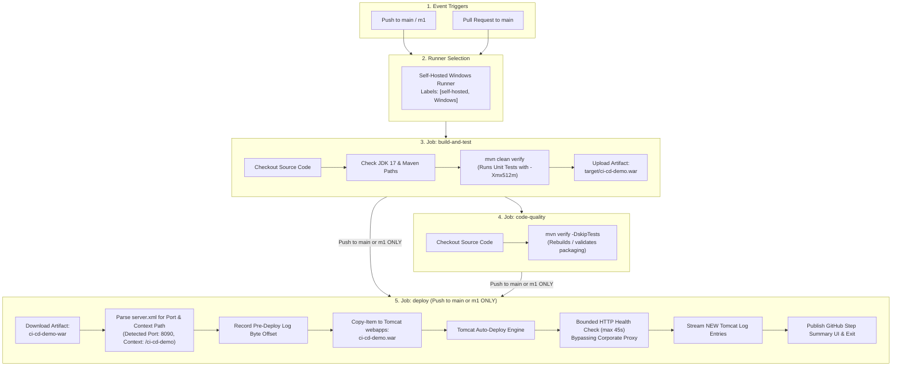

# GitHub Actions Workflow Technical Analysis Report

**Repository**: `anchitchourasia/complete-ci-cd-v1`  
**Primary Target**: `.github/workflows/cicd.yml`  
**Document Purpose**: Comprehensive technical analysis of the GitHub Actions CI/CD pipeline, architecture, triggers, job breakdown, PowerShell deploy script mechanics, and operational boundaries.

---

## 1. End-to-End Workflow Architecture Diagram

---

## 2. Event Triggers & Job Execution Matrix

* **File Reference**: [.github/workflows/cicd.yml](.github/workflows/cicd.yml)

| Event / Branch | `build-and-test` | `code-quality` | `deploy` |
| :--- | :---: | :---: | :---: |
| **Push to `main`** | Runs | Runs | **Runs** |
| **Push to `m1`** | Runs | Runs | **Runs** |
| **Pull Request to `main`** | Runs | Runs | **Skipped** |
| **Pull Request to `m1`** | Does Not Trigger | Does Not Trigger | **Does Not Trigger** |

### Event Rules Explanation:
- `on.push.branches: [main, m1]`: Triggers workflow execution on code commits pushed directly to `main` or `m1`.
- `on.pull_request.branches: [main]`: Triggers workflow execution on Pull Requests targeting the `main` branch.
- `deploy.if`: `github.event_name == 'push' && (github.ref == 'refs/heads/main' || github.ref == 'refs/heads/m1')` restricts deployment execution **only** to push events on `main` or `m1`. Pull Requests are explicitly excluded from deployment.

---

## 3. Why the `deploy` Job May Be Skipped

1. **Event Type Mismatch**: Triggered by a `pull_request` event (`github.event_name` equals `'pull_request'`).
2. **Branch Mismatch**: Triggered by a push to a branch other than `main` or `m1` (e.g. `feature/login`).
3. **Upstream Job Failure**: If either `build-and-test` or `code-quality` fails or is canceled. `deploy` specifies `needs: [build-and-test, code-quality]`.

---

## 4. Runner Selection (`runs-on: [self-hosted, Windows]`)

- **Matching Logic**: The label selector `runs-on: [self-hosted, Windows]` matches **any** active registered GitHub Actions self-hosted runner daemon assigned to the repository/organization that possesses both `self-hosted` and `Windows` labels. It is not hardcoded to a single physical PC host.
- **Queue Behavior**: If an active runner matching both labels is online, the job is assigned to it; otherwise, the job remains in a queued state until an eligible runner comes online.

---

## 5. Environment Variables Breakdown

| Variable | Value | Purpose |
| :--- | :--- | :--- |
| `MAVEN_BIN` | `C:\maven\apache-maven-3.9.12\...\bin\mvn.cmd` | Absolute path to the Maven command-line script on the runner host. |
| `SETTINGS_XML` | `C:\maven\settings.xml` | Absolute path to Maven settings configuring corporate repository mirrors. |
| `JAVA_HOME` | `C:\Program Files\Java\jdk-17` | Root directory of the installed Java 17 Development Kit. |
| `HTTP_PROXY` | `http://192.168.9.112:808` | Corporate HTTP proxy server URL for outbound requests. |
| `HTTPS_PROXY` | `http://192.168.9.112:808` | Corporate HTTPS proxy server URL for outbound requests. |
| `NO_PROXY` | `192.168.8.25,localhost,127.0.0.1` | Hostnames and IP addresses that bypass corporate proxy. |
| `MAVEN_OPTS` | `-Xmx512m -Xms256m` | JVM memory limits capping heap size to prevent Windows virtual memory pagefile allocation errors (`DOS errno 1455`). |

### Key Differences:
- **`MAVEN_BIN` vs. `JAVA_HOME`**: `MAVEN_BIN` points directly to the `mvn.cmd` binary file; `JAVA_HOME` points to the JDK root folder (whose `bin` folder is added to `$env:PATH` in step scripts).
- **`SETTINGS_XML`**: Configures Maven dependency resolution and mirror repositories.
- **`HTTP_PROXY`/`HTTPS_PROXY` vs. `NO_PROXY`**: `HTTP_PROXY`/`HTTPS_PROXY` route outbound HTTP traffic through the corporate gateway; `NO_PROXY` excludes local traffic (`localhost`, `127.0.0.1`).
- **`MAVEN_OPTS`**: Limits JVM memory heap allocation (`-Xmx`/`-Xms`) for Maven background processes.

---

## 6. Jobs & Steps Detailed Walkthrough

### Workflow Global Configuration
- `name`: Human-readable title displayed in the GitHub Actions UI.
- `on`: Trigger event definitions (`push` on `main`/`m1`, `pull_request` on `main`).
- `permissions`: Sets GITHUB_TOKEN scope (`contents: read`).
- `defaults`: Configures `powershell` as default shell for all `run:` script blocks.
- `env`: Global environment variables accessible by all steps.

### Job 1: `build-and-test`
- **Step 1 (Checkout source code)**: Uses `actions/checkout@v4` to download workspace files.
- **Step 2 (Check local JDK and Maven)**: Verifies presence of `java.exe`, `mvn.cmd`, and `settings.xml`. Prepends JDK `bin` to `$env:PATH` and outputs `mvn -version`.
- **Step 3 (Build WAR and run tests)**: Executes `mvn -s ... clean verify --no-transfer-progress`. Compiles code, runs JUnit unit tests via Surefire plugin, and packages `target/ci-cd-demo.war`.
- **Step 4 (Upload WAR artifact)**: Uses `actions/upload-artifact@v4` to upload `target/ci-cd-demo.war` as artifact `ci-cd-demo-war` (retention: 7 days).

### Job 2: `code-quality`
- **Dependencies**: `needs: build-and-test`.
- **Step 1 (Checkout source code)**: Downloads repository code.
- **Step 2 (Run Maven verify)**: Executes `mvn -s ... verify -DskipTests --no-transfer-progress`. Re-runs Maven verification to validate packaging structure while explicitly skipping unit tests. *(Note: Does not run SonarQube or external static analysis).*

### Job 3: `deploy`
- **Dependencies & Conditions**: `needs: [build-and-test, code-quality]`, `if: push to main or m1`.
- **Concurrency Lock**: `concurrency: group: local-tomcat-deploy` prevents overlapping deployments.
- **Step 1 (Download tested WAR)**: Uses `actions/download-artifact@v4` to download `ci-cd-demo-war` into `./deploy-artifact/`.
- **Step 2 (Deploy WAR to Tomcat webapps)**: Comprehensive PowerShell script that resolves paths, parses Tomcat `server.xml`, copies the WAR, polls health endpoint while bypassing proxy, streams logs, and writes GitHub Step Summary.

---

## 7. PowerShell Deploy Script Breakdown

- **`$targetPath`**: Destination directory for WAR deployment. Reads secret `${{ secrets.TOMCAT_WEBAPPS_PATH }}`; if empty/whitespace, falls back to `E:\apache-tomcat-10.1.28\webapps`.
- **`$warSrc`**: Path to downloaded artifact (`$env:GITHUB_WORKSPACE\deploy-artifact\ci-cd-demo.war`).
- **`$warDest`**: Full destination path in Tomcat webapps (`$targetPath\ci-cd-demo.war`).
- **`$tomcatBase`**: Parent directory of `$targetPath` (`E:\apache-tomcat-10.1.28`).
- **`$serverXml`**: Path to Tomcat configuration file (`E:\apache-tomcat-10.1.28\conf\server.xml`).
- **`[xml]$tomcatConfig`**: Reads and parses `server.xml` as an XML object.
- **Port Detection (`$httpConnector` / `$tomcatPort`)**: Searches XML `<Connector>` nodes for non-AJP HTTP connectors with a numeric port attribute, extracting port string (e.g. `'8090'`).
- **WAR Context Path Detection (`$warBaseName` / `$contextPath`)**: Extracts WAR base name (`ci-cd-demo`). If name is `'ROOT'`, context path is `''`; otherwise, replaces `#` with `/` to derive context path (`/ci-cd-demo`).
- **`$healthUrl`**: Constructs target URL dynamically (`http://localhost:8090/ci-cd-demo/test/msg`).
- **`$logsDir` & `$catalinaLog`**: Resolves path to `logs/catalina.yyyy-MM-dd.log`.
- **`$deployStartTime` & `$initialLogSize`**: Records current timestamp and initial byte length of `catalina.log` before copying WAR.
- **`Copy-Item -LiteralPath $warSrc -Destination $warDest -Force -ErrorAction Stop`**: Transfers new WAR to Tomcat `webapps`, overwriting existing file.
- **Polling Controls (`$timeoutSec = 45`, `$pollIntervalSec = 3`)**: Bounded loop running up to 45 seconds to poll the application endpoint.
- **Proxy Clearing/Restoring**: Temporarily sets `$env:HTTP_PROXY = ""` and `$env:HTTPS_PROXY = ""` inside a `try/finally` block so `Invoke-WebRequest` reaches local port 8090 directly without hitting corporate proxy `192.168.9.112:808`.
- **`Invoke-WebRequest -Uri $healthUrl -UseBasicParsing -TimeoutSec 5 -ErrorAction Stop`**: Sends HTTP GET to application health endpoint.
- **Log Filtering (`System.IO.File::Open`, `$stream.Position = $initialLogSize`)**: Opens `catalinaLog` with `FileShare.ReadWrite`, seeks past `$initialLogSize`, and reads ONLY new lines added during deployment, filtering for `ci-cd-demo`, `HostConfig`, `Exception`, or `Error`.
- **Failure Behavior**: If health check does not succeed within 45 seconds, executes `throw`, causing the deployment step and job to fail.
- **`$env:GITHUB_STEP_SUMMARY`**: Appends formatted Markdown summary (WAR name, port, context path, health URL, status) to the GitHub Actions Run Summary UI page.

---

## 8. Behavior When WAR File Already Exists in Tomcat Webapps

1. **File Overwrite**: `Copy-Item -Force` overwrites `E:\apache-tomcat-10.1.28\webapps\ci-cd-demo.war`.
2. **Tomcat Auto-Deploy Detection**: Tomcat's `HostConfig` background scanner thread detects the modified timestamp of `ci-cd-demo.war`.
3. **Redeployment Cycle**:
   - Tomcat redeploys the application context according to its `HostConfig` rules (`autoDeploy`, `unpackWARs`).
   - Stops the previous application context `/ci-cd-demo`.
   - Unpacks and binds the updated `ci-cd-demo.war` application context `/ci-cd-demo`.

---

## 9. What the Workflow Proves vs. What It Does NOT Prove

### What It PROVES:
- Source code compiles with Java 17.
- Unit tests pass under Maven Surefire.
- Maven WAR packaging succeeds (`ci-cd-demo.war`).
- Artifact uploads and downloads between workflow jobs.
- WAR file copies into Tomcat `webapps/`.
- Tomcat port and context path are dynamically parsed from `server.xml` and filename.
- Application health endpoint (`http://localhost:8090/ci-cd-demo/test/msg`) responds with `HTTP 200 OK` with payload `"Hello Test Controller"` within 45 seconds.
- Deployment details publish to GitHub Actions Summary UI.

### What It Does NOT Prove:
- Does NOT perform static code security analysis (no SonarQube/SpotBugs).
- An HTTP 200 response with `"Hello Test Controller"` confirms endpoint availability, but does **not** distinguish build version if payload string is unchanged across builds.
- Does NOT provide zero-downtime deployment (brief endpoint unavailability occurs during WAR extraction).
- Does NOT provide automated rollback if Tomcat fails to boot the new context.

---

## 10. Machine-Specific Settings & Assumptions

### Machine-Specific Settings:
- `MAVEN_BIN`: `C:\maven\apache-maven-3.9.12\...\bin\mvn.cmd`
- `SETTINGS_XML`: `C:\maven\settings.xml`
- `JAVA_HOME`: `C:\Program Files\Java\jdk-17`
- Fallback Tomcat webapps path: `E:\apache-tomcat-10.1.28\webapps`
- Corporate Proxy IP: `http://192.168.9.112:808`

### Assumptions:
- Self-hosted Windows runner host machine has Java 17, Maven 3.9.12, and Tomcat 10.1 installed at specified locations.
- Local Tomcat instance is currently running as a background service/process listening on port 8090.
